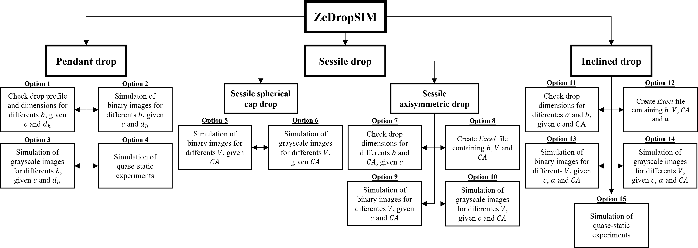

# ZeDrop

## ZeDropSIM

Simulation is important for understanding drop behavior in different configurations, for evaluating the effects of process parameters on their shape, and for verifying and validating new analysis routines for measuring surface properties. In the latter case, it is essential that images of the drop can be generated and sources of error present during the measurement process can be reproduced and isolated in order to evaluate the accuracy and robustness of the routines developed for evaluating real drop configurations.

Within this scope, ZeDropSIM was developed for verifying and simulating different drop configurations, such as pendant, sessile, and inclined drops. The program has several functionalities, such as two-dimensional (2D) and three-dimensional (3D) drop profiles can be generated, binary and grayscale images can be simulated, and sequences of consecutive images can be created to simulate quasi-static experiments. In addition, several sources of error can be added to the simulated image like lack of sharpness, lack of contrast, non-uniform illumination, random disturbance in the drop profile, vertical misalignment of the camera, uniform noise, Gaussian noise, impulse noise and satellite droplets. <strong>Figure 1</strong> presents a flowchart that summarizes, according to the available drop configurations, all the functionalities offered by ZeDropSIM.

<strong>Figure 1. ZeDropSIM flowchart. </strong>

ZeDropSIM was developed in Matlab. All the routines are present in ZeDropSIM folder. To start ZeDropSIM, <em>MainCode_ZeDropSIM.m</em> file must be run. 

## ZeDropACT

The implementation of optical methods for analyzing drops involves hardware and software requirements. The hardware requirements are related to the experimental apparatus needed to perform the tests and capture images. The software must be able to analyze the captured images, identify and extract the drop profile and, using drop shape analysis methods, determine surface properties, such as liquid surface tension and contact angle. Although commercial solutions exist for determining surface properties using optical methods, these are expensive and often inaccessible.

Given this scenario, the ZeDropACT solution was developed. ZeDropACT aims to provide an affordable solution for performing tests involving drops to obtain reliable measurements of surface properties using optical methods. ZeDropACT consists of independent hardware and software solutions. In terms of hardware, a low-cost, modular goniometer project capable of performing different tests was designed, while in terms of software, a program capable of controlling different process variables and following different test protocols was developed. 

