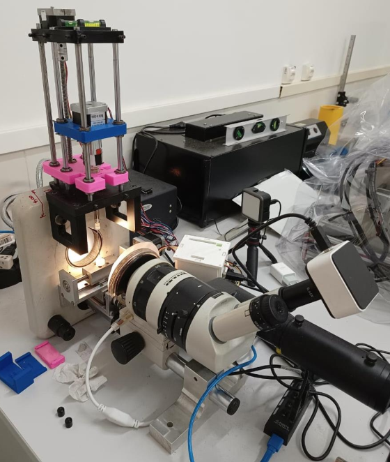
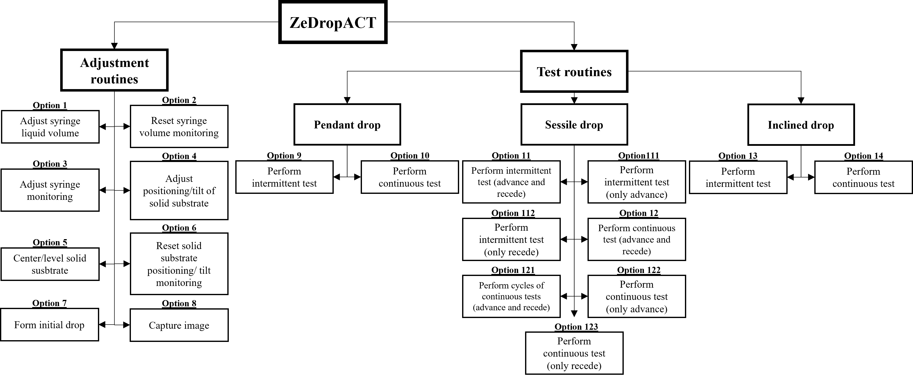
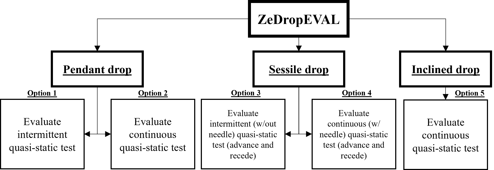

# ZeDrop

Despite advances in computing and optical devices, the use of optical methods for accurate, robust and in-depth evaluation of interfacial properties is still limited. The hardware required to perform adequate and reliable experiments is sophisticated and expensive, and the software, which contains all the control of experimental parameters and execution of drop shape analysis methods, is commonly sold together with the hardware.

Thus, the ZeDrop solution was created to enable accessible and reliable measurements of surface properties using optical methods. ZeDrop is an open-source, intuitive, versatile and robust solution for studying surface properties, such as liquid surface tension and contact angle, in different drop configurations.

The development of ZeDrop resulted in three major branches: (i) ZeDropSIM, enabling the simulation of drop profiles, images and surfaces, including the addition of error sources, (ii) ZeDropACT, offering a low-cost hardware design for conducting tests involving drops and free software for running experiments and capturing images, and (iii) ZeDropEVAL, allowing the use of optical methods for analyzing droplet shape and determining surface properties, such as contact angle and liquid surface tension.

## ZeDropSIM

Simulation is important for understanding drop behavior in different configurations, for evaluating the effects of process parameters on their shape, and for verifying and validating new analysis routines for measuring surface properties. In the latter case, it is essential that images of the drop can be generated and sources of error present during the measurement process can be reproduced and isolated in order to evaluate the accuracy and robustness of the routines developed for evaluating real drop configurations.

Within this scope, ZeDropSIM was developed for verifying and simulating different drop configurations, such as pendant, sessile, and inclined drops. The program has several functionalities, such as two-dimensional (2D) and three-dimensional (3D) drop profiles can be generated, binary and grayscale images can be simulated, and sequences of consecutive images can be created to simulate quasi-static experiments. In addition, several sources of error can be added to the simulated image like lack of sharpness, lack of contrast, non-uniform illumination, random disturbance in the drop profile, vertical misalignment of the camera, uniform noise, Gaussian noise, impulse noise and satellite droplets. <strong>Figure 1</strong> presents a flowchart that summarizes, according to the available drop configurations, all the functionalities offered by ZeDropSIM.

<strong>Figure 1. ZeDropSIM flowchart. </strong>

ZeDropSIM was developed in Matlab. All the routines are present in ZeDropSIM folder. To start ZeDropSIM, <em>MainCode_ZeDropSIM.m</em> file must be run. 

## ZeDropACT

The implementation of optical methods for analyzing drops involves hardware and software requirements. The hardware requirements are related to the experimental apparatus needed to perform the tests and capture images. The software must be able to analyze the captured images, identify and extract the drop profile and, using drop shape analysis methods, determine surface properties, such as liquid surface tension and contact angle. Although commercial solutions exist for determining surface properties using optical methods, these are expensive and often inaccessible.

Given this scenario, the ZeDropACT solution was developed. ZeDropACT aims to provide an affordable solution for performing tests involving drops to obtain reliable measurements of surface properties using optical methods. ZeDropACT consists of independent hardware and software solutions. In terms of hardware, a low-cost, modular goniometer project capable of performing different tests was designed, while in terms of software, a program capable of controlling different process variables and following different test protocols was developed.

The lab-design goniometer was based on a stereomicroscope found in most laboratories. It consists of six main systems: (i) image acquisition, (ii) illumination, (iii) volumetric dispensing, (iv) solid substrate positioning, (v) solid substrate inclination and (vi) control. Depending on the test to be performed and the drop configuration to be analyzed, it is not necessary to manufacture all the modules. The solid substrate positioning and inclination systems are interchangeable, with the first being indicated for the evaluation of sessile drops, while the second for the evaluation of inclined drops. For the evaluation of pendant drops, it is not necessary to use either of these two systems.

In its complete version, the lab-design goniometer allows the control of several process variables, such as syringe positioning, drop volume and positioning/inclination of the solid substrate. Thus, it allows the performance of static, quasi-static and dynamic tests involving pendant, sessile and inclined drops. Figure 2 shows a real image of the developed goniometer with the solid substrate positioning module connected.

Further details of the lab-design goniometer can be found in the lab-design goniometer folder. This folder contains models of the components that can be obtained by 3D printing.

<strong>Figure 2. Lab-design goniometer with solid substrate positioning module connected. </strong>

With ZeDropACT software, the user has access to adjustment and test routines. The adjustment routines allow fine adjustment of the different systems that make up the goniometer, while the test routines execute previously established procedures for image acquisition and subsequent determination of surface properties by optical methods.

It is possible to perform intermittent and continuous tests, involving pendant, sessile and inclined drops. It is important to highlight that for certain types of tests, such as quasi-static and dynamic, it is necessary to use electronic, mechanical and optical components that allow more refined and rigorous control of the process variables.

After starting the ZeDropACT software, a menu is displayed showing all the program's functionalities. Figure 3 shows a flowchart containing all the options offered. Options 1 to 8 are related to the adjustment routines, while options 9 to 14 are linked to the execution of the test routines.

<strong>Figure 3. ZeDropACT flowchart. </strong>

ZeDropACT was developed in Matlab. All the routines are present in ZeDropACT folder. To start ZeDropSIM, MainCode_ZeDropACT.m file must be run.

The ZeDropACT software does not contain drop shape analysis routines. The main result produced by the software is drop image. In order to identify the drop profile, analyze its shape and determine surface properties, it is necessary to use another solution. The ZeDropEVAL software can be used for this purpose.

## ZeDropEVAL

ZeDropEVAL is an open-source program designed to evaluate drop images and data related to surface properties. Together with ZeDropSIM and ZeDropACT, it aims to offer a free, simple, user-friendly, intuitive, versatile and reliable solution for studying surface properties.

Although ZeDropEVAL does not have a graphical user interface (GUI), the program is based on user interaction. This enables the execution of routines and access to settings through menus and sequential queries. During the execution of the main routines, a preliminary analysis of the available methods is allowed, with partial results being shown, and the possibility of modifying the settings. This provides an instant evaluation of each processing step and continuous learning as the program runs. For most user questions, the program offers suggested default answers, preventing the user from getting stuck during the execution of the routines.

During its design, ZeDropEVAL was planned to handle the results from ZeDropACT. Therefore, most of the analysis options offered by ZeDropEVAL focus on the evaluation of quasi-static tests. However, there is nothing that prevent the user from using the program to evaluate data/images from static or even dynamic tests.

Several analysis methods are offered in the available options, and the software is capable of handling different types, qualities and drop configurations. Intrinsically, the software was developed for the analysis of sequential data/images, but a single data/image can be loaded and examined. Figure 4 summarizes all the options offered by ZeDropEVAL for the evaluation of drops. It is possible to evaluate pendant drops, sessile drops and inclined drops, as well as intermittent and continuous tests.

<strong>Figure 4. ZeDropEVAL flowchart.</strong>

The software has specific routines for the evaluation of each type of configuration and test. For the evaluation of pendant drops, the ZeDropEVAL works in cooperation with Giada. First, the images obtained during the test involving a pendant drop are analyzed in Giada, and then the results obtained are read in ZeDropEVAL, which organizes them in tables and conveniently exports them in text files for better user evaluation. For sessile and inclined drops, the software allows direct analysis of the captured images and determination of important drop angles and properties. In general, the analysis of sessile and inclined drops involves seven steps: (i) loading the data, (ii) determining the scale factor, (iii) cropping the images, (iv) detecting the contours and determining the baseline, (v) generalizing the baseline, (vi) analyzing the drop shape and determining the contact angles, and (vii) exporting the results. In the case of continuous tests involving sessile drops (with a needle), an additional step of identifying the needle is necessary.

 

During image pre-processing, ZeDropEVAL allows the user to improve/correct contrast and use smoothing filters. In the contour detection stage, several edge detection methods are available, including gradient and non-gradient methods, with pixel and subpixel precision, such as Sobel, Prewitt, Roberts, LoG (Laplacian of Gaussian), Canny, zero-crossing and PAE (Partial Area Effect). In post-processing, the identified contours undergo correction and data organization routines, allowing the use of morphological operations. To determine the baseline, the software provides automatic detection options for drops with and without reflection, in addition to the possibility of manual determination. The contour detection and baseline determination stage is characterized by intense interaction with the user. In this, the software allows the user to change the pre-processing, contour detection, post-processing and baseline determination settings, check the functioning of each of these steps on an image, proceed with the established settings for all loaded images and filter the resulting images according to an acceptable baseline inclination limit.

 

ZeDropEVAL provides five methods for analyzing the drop shape: (i) circle fitting, (ii) polynomial fitting, (iii) polynomial fitting (Dropen), (iv) ellipse fitting and (v) mask method. Since the methods are executed independently, they can be executed simultaneously, and it is up to the user to enable those of interest. In addition to determining the contact angle, other important properties are calculated, such as the displacement or distance traveled by the triple contact point (𝑥𝐷𝑖𝑠𝑝𝐶𝑃, 𝑦𝐷𝑖𝑠𝑝𝐶𝑃) and the velocity of the triple contact point (𝑣𝑒𝑙). In the case of continuous testing involving sessile drops (without a needle), the ZeDropEVAL program also estimates the drop volume. Two methods are used to estimate the drop volume: (i) the spherical cap method and (ii) the disk method.

 

At the end of the software, the results are exported in text files and figures. The text files contain various calculated properties for all images, a description of the settings used, and a baseline tilt analysis report. The exported figures contain plots of the behavior of the contact angle and the position, displacement, and velocity of the triple contact points in relation to the process parameter changed during the test (drop volume for sessile drops and tilt angle for inclined drops).

 

ZeDropEVAL was developed in Matlab. All the routines are present in ZeDropEVAL folder. To start ZeDropSIM, MainCode_ZeDropEVAL.m file must be run.

